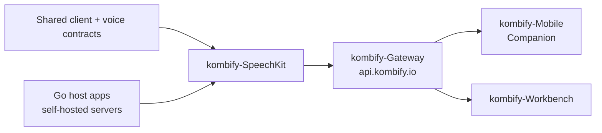

# SpeechKit

[](STATUS.md)
[](https://pkg.go.dev/github.com/kombifyio/SpeechKit)
[](LICENSE)
[](go.mod)

SpeechKit is a local-first voice framework, server, device runtime, and the
home of the shared voice contracts. The kernel is platform-neutral Go and can be
embedded directly, run as a self-hosted server, or used through a device client.

> **Beta.** Public APIs, config keys, and defaults can still change between
> minor releases. Use it in production only with version pins. Pre-1.0 releases
> use the `v0.MAJOR.MINOR` scheme; breaking changes are called out in each
> [CHANGELOG.md](CHANGELOG.md) entry.

> Local testing standard: run the public verification gate before any deploy.
> See [CONTRIBUTING.md](CONTRIBUTING.md#public-verification).

## Scope

This repository owns:

- The platform-neutral Go voice kernel in `pkg/speechkit`: mode contracts,
  provider profiles, routing policy, readiness metadata, and the reusable
  Dictation, Assist, and Voice Agent services.
- The self-host server target in `cmd/speechkit-server`, which wraps the same
  kernel behind HTTP and WebSocket APIs plus its OpenAPI/AsyncAPI contracts.
- The agent-facing surfaces: the `speechkit-mcp` MCP server and the
  `speechkit-cli` command-line tool.
- The Windows Wails device client in `cmd/speechkit`, a reference
  implementation of a device target — not a separate product.
- The shared voice surface contract consumed by Kombify Companion, Workbench,
  and embeds.

This repository does not own:

- Product identity, tenancy, entitlement decisions, or edge policy. Those belong
  to `kombify-Gateway` and the platform standards.
- Cloud AI provider-key custody for the platform. `kombify-AI-Platform` is the
  only cloud provider-key custodian; SpeechKit deliberately keeps its own
  self-contained provider layer so the open-core framework stays usable
  standalone.
- The consuming client UX of Companion, Workbench, or any embedding host.

When a SpeechKit server is operated as a Kombify-hosted surface, its public
traffic goes through `https://api.kombify.io`.

## Runtime And Stack

| Concern | Choice |
| --- | --- |
| Language / runtime | Go 1.26+ (kernel, server, CLI, MCP); Node.js 22+ for the client frontend |
| Device client | Wails v3 (Windows 10/11 x64, WASAPI capture and playback) |
| Server target | Linux container, `net/http` + WebSocket, OpenAPI and AsyncAPI contracts |
| Package managers | Go modules, npm, `mise` for the task surface |
| Authentication | Bearer tokens or edge-auth for the server target; Auth0 JWT at `api.kombify.io` for the Kombify-hosted deployment |
| Data | SQLite by default (pure-Go driver); optional PostgreSQL 17; Render Managed Postgres for the hosted server target |
| Voice providers | whisper.cpp, Piper, OpenAI, Google, Groq, Deepgram, AssemblyAI, Hugging Face, OpenRouter, Ollama |
| Delivery | GitHub Releases (Windows installer and portable), `ghcr.io/kombifyio/speechkit-server` container |

SpeechKit imports no Kombify Go modules — it has no dependency on
`kombify-go-common` and does not call `/v1/ai/*`. That self-containment is a
deliberate open-core exception. The relationships that do exist are contract and
edge relationships: shared client and voice contracts, and
`kombify-Gateway` as the edge for the Kombify-hosted server target consumed by
Companion and Workbench.

Public dependency and export rules are documented in the
[SDK surface boundary](docs/architecture/sdk-surface-boundary.md).

## Repository Context

<!-- generated: repo-context v2026-07-19; source: PLATFORM-ARCHITECTURE-TARGET.md ownership map -->



The public kernel and adapter boundary is documented in the
[SDK surface boundary](docs/architecture/sdk-surface-boundary.md).

## Modes

The runtime targets share the same three strict modes:

| Mode | Purpose | Boundary |
| --- | --- | --- |
| Dictation | Turn speech into text. | STT only. No LLM rewriting, no utilities, no codewords. |
| Assist | Turn speech or text into one useful result. | Codeword, utility, or LLM output with optional TTS and explicit UI surface metadata. |
| Voice Agent | Run realtime audio-to-audio dialogue. | Live conversation for brainstorming, support, and fast follow-ups. |

Hands-Free is not a fourth mode. It is an activation and voice-output layer over
the three modes: wake activation, microphone capture, auto-end policy, and
optional speaker output.

Words and Replacements are the first-class customization axis over the same
three modes. Words teach SpeechKit terms to recognize; Replacements define
deterministic text, command, snippet, synonym, and template transformations.
See the
[Words And Replacements standard](docs/words-and-replacements-standard.md).

Speaker diarization, identification, and attribution are add-on capabilities.
Provider support and auth status are tracked in the
[voice capability matrix](docs/capabilities/voice-capability-matrix.json).

## Targets

| Target | Entry point | Use it when |
| --- | --- | --- |
| Local-first Go kernel | `pkg/speechkit` | You embed voice into your own Go product, internal tool, prototype, or automation host. |
| Self-host server | `cmd/speechkit-server` | You need a durable Linux process for your own clients, teams, browsers, or centrally managed provider configuration. |
| Agent tools | `cmd/speechkit-mcp`, `cmd/speechkit-cli` | An agent or operator should inspect the framework, generate starters, validate payloads, or operate a self-hosted server. |
| Windows device client | `cmd/speechkit` | You want a ready-to-run desktop reference host for local use, provider testing, or server-connected workflows. |

Desktop device support is Windows 10/11 x64 only today. Linux is supported as a
server runtime, not as a desktop capture client; macOS and Linux desktop
packages are not currently supported. Default device hotkeys are `Ctrl+Win`
(Dictation), `Win+Alt` (Assist), and `Ctrl+Shift` (Voice Agent).

Public Windows builds are published on
[GitHub Releases](https://github.com/kombifyio/SpeechKit/releases). A fresh
clone also carries current installer metadata in `release/latest/windows/`,
including canonical download URLs and SHA-256 hashes; the GitHub Release assets
remain canonical.

## Quick Start

Embed the Go kernel:

```bash
go get github.com/kombifyio/SpeechKit
```

Import only the components your host needs: `pkg/speechkit/dictation` for
dictation, `pkg/speechkit/wakeword` for activation, `pkg/speechkit/tts` for
spoken output, `pkg/speechkit/companion` plus Assist/TTS adapters for one-shot
Voice Companion hosts, `pkg/speechkit/speaker` for speaker-aware apps, and
`pkg/speechkit/client` for server-connected apps.

To drive the framework from a `config.toml` instead of building settings by
hand, `pkg/speechkit/hostconfig` turns a config file into the public
`ModeSettings` and a starting `RuntimePolicy` in one call:

```go
settings, policy, err := hostconfig.Load("config.toml")
```

Real providers run in-process — no SpeechKit server required. Two runnable
references:

```bash
# in-process Voice Agent (Gemini Live), no server:
GOOGLE_AI_API_KEY=... go run ./examples/voice-agent/in-process
# in-process Assist (host-owned LLM + optional public TTS), no server:
GOOGLE_AI_API_KEY=... go run ./examples/assist/in-process
```

Scaffold a single-prompt Go starter, run the server image, or drive the agent
tools:

```bash
speechkit-cli init --template go-assist-voice-companion ./my-companion
docker pull ghcr.io/kombifyio/speechkit-server:latest
go run ./cmd/speechkit-mcp --mode=docs,test
go run ./cmd/speechkit-cli status --server "$SPEECHKIT_SERVER_URL" --token "$SPEECHKIT_SERVER_TOKEN"
```

More starting points: [Framework API](docs/speechkit-framework-api.md),
[Voice Companion](docs/voice-companion.md), and
[examples/](examples/README.md).

## Common Commands

Public source verification:

```bash
go test ./pkg/... ./cmd/speechkit-cli/... ./cmd/speechkit-mcp/... ./examples/...
GOOS=linux CGO_ENABLED=0 go build ./cmd/speechkit-server ./cmd/speechkit-mcp ./cmd/speechkit-cli
```

The complete public-clone gate is documented in
[CONTRIBUTING.md](CONTRIBUTING.md#public-verification).

## Local Gate

The repository gate runs locally before CI or any deploy dispatch. CI does not
replace it.

```bash
mise run test:e2e:local          # the canonical bounded exact-source gate
mise run doctor:container        # confirm a container engine is reachable first
```

`test:e2e:local` is a real gate, not a wrapper: it runs the bounded
device-agent → Home Assistant → state-verify → Piper process end-to-end
(`test:device-agent-ha-local-e2e`) and the headless dictation hold-to-talk
capture gate (`test:dictation-hold-gate`, which needs no microphone, keyboard
or Docker).

Any Docker-API engine satisfies the container requirement — Docker Desktop,
Podman, colima or a remote `DOCKER_HOST`. Docker Desktop is one option, never a
prerequisite.

Two surfaces need a different path. The Server-Target is `//go:build linux` and
cannot run natively on a Windows host; run it in a `golang:1.26` container,
which needs `pkg-config`, `libopus-dev`, `libopusfile-dev` and `libsoxr-dev`
installed before the audio-dependent packages will build. The Windows
Device-Target builds through
`powershell -ExecutionPolicy Bypass -File scripts/build.ps1 -SkipInstaller`;
a raw `go build ./cmd/speechkit/` bypasses required CGo and ldflags.

Gate contract and evidence rules: workspace `LOCAL-E2E-DEPLOYMENT-STANDARD.md`.
While the product version is below 1.0.0 the `fast-pre-1.0` profile defers this
gate to stable promotion and production deploys; fail-closed production receipt
gates and provider/secret safety invariants stay mandatory regardless.

## Repository Layout

```text
pkg/speechkit/          Public Go kernel and SDK surface
cmd/speechkit/          Windows device client (reference implementation)
cmd/speechkit-server/   Self-host server entry point
cmd/speechkit-mcp/      MCP server for agent docs, validation, and management
cmd/speechkit-cli/      CLI diagnostics, scaffolding, and quick actions
internal/               Implementation packages behind the public binaries
docs/                   Detailed documentation
deploy/                 Container and server configuration
scripts/                Install and release-note helpers
```

## Standards

- [CONTRIBUTING.md](CONTRIBUTING.md)
- [SDK surface boundary](docs/architecture/sdk-surface-boundary.md)
- [SECURITY.md](SECURITY.md)
- [CODE_OF_CONDUCT.md](CODE_OF_CONDUCT.md)
- [SUPPORT.md](SUPPORT.md)

## Documentation

| Document | Purpose |
| --- | --- |
| [docs/README.md](docs/README.md) | Documentation index |
| [docs/architecture/sdk-surface-boundary.md](docs/architecture/sdk-surface-boundary.md) | Public SDK and export boundary |
| [docs/speechkit-framework-api.md](docs/speechkit-framework-api.md) | Public framework API contracts |
| [docs/api/openapi.v1.yaml](docs/api/openapi.v1.yaml) | Local control-plane OpenAPI |
| [docs/server/README.md](docs/server/README.md) | Server target documentation |
| [docs/server/openapi.v1.yaml](docs/server/openapi.v1.yaml) | Server OpenAPI contract |
| [docs/mcp/README.md](docs/mcp/README.md) | MCP server documentation |
| [docs/agent/llms.txt](docs/agent/llms.txt) | Agent entrypoint |
| [CONTRIBUTING.md](CONTRIBUTING.md) | Public development and verification workflow |
| [CHANGELOG.md](CHANGELOG.md) | Release notes |

Generated agent documentation never overrides this README or the detailed
public documentation.

## Issue Tracking

Public issues and contributions use the
[GitHub repository](https://github.com/kombifyio/SpeechKit). Internal planning
metadata is not part of the public source export.

## Dual-Repo

The consumer-facing source repository is `kombifyio/SpeechKit`: the `go get`
path, Go Reference badge, container image, and release assets all use that
identity. The public source tree is produced by an allowlist-based export from
governed working source. Exported code and documentation must remain usable
without access to that working repository; see
[CONTRIBUTING.md](CONTRIBUTING.md) and the
[SDK surface boundary](docs/architecture/sdk-surface-boundary.md).

## Trust

Public releases include checksums and an unsigned Windows notice while the
no-cost unsigned release path is active. Download only from the official
[kombifyio/SpeechKit releases](https://github.com/kombifyio/SpeechKit/releases).

## License

Apache-2.0. See [LICENSE](LICENSE).
